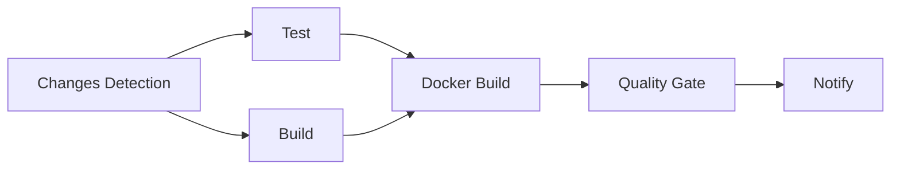

# CI/CD Documentation

Este documento descreve o pipeline completo de Continuous Integration e Continuous Deployment para o projeto Zendapag.

## 📋 Visão Geral

O Zendapag implementa um pipeline CI/CD completo com múltiplos workflows:

- **CI Pipeline**: Build, test e quality gates para Pull Requests
- **CD Staging**: Deploy automático para ambiente de staging
- **CD Production**: Deploy manual com aprovação para produção
- **Security**: Scans de segurança automatizados
- **Release**: Geração automática de releases

## 🔄 Workflows

### 1. Continuous Integration (ci.yml)

**Triggers:**
- Pull Requests para `main` e `develop`
- Push para `main` e `develop`

**Jobs:**


**Quality Gates:**
- ✅ Testes unitários e integração passando
- ✅ Code coverage > 80%
- ✅ SonarCloud quality gate
- ✅ Build sem erros
- ✅ Docker images funcionais

### 2. CD Staging (cd-staging.yml)

**Triggers:**
- Push para branch `develop`
- Workflow manual

**Pipeline:**
1. **Build & Push**: Constrói e publica imagens Docker
2. **Deploy**: Deploy para EKS staging com Helm
3. **Health Checks**: Verificações de saúde pós-deploy
4. **Rollback**: Rollback automático em caso de falha
5. **Smoke Tests**: Testes básicos de funcionamento

**Environment:** `staging`

### 3. CD Production (cd-production.yml)

**Triggers:**
- Release publicado
- Workflow manual com aprovação

**Pipeline:**
1. **Approval**: Aprovação manual obrigatória
2. **Pre-deployment Tests**: Testes completos
3. **Build & Push**: Imagens assinadas com Cosign
4. **Blue-Green Deploy**: Deploy sem downtime
5. **Production Tests**: Testes em produção
6. **Traffic Switch**: Mudança de tráfego
7. **Health Monitor**: Monitoramento pós-deploy

**Environment:** `production`

### 4. Security (security.yml)

**Triggers:**
- Diário às 2h UTC
- Push/PR para branches principais
- Workflow manual

**Scans:**
- 🔒 OWASP Dependency Check
- 🔍 CodeQL SAST
- 🛡️ Semgrep SAST
- 🐳 Docker security (Trivy + Hadolint)
- 🔑 Secrets detection (GitLeaks + TruffleHog)
- 🏗️ Infrastructure scan (Checkov)
- 📄 License compliance

### 5. Release (release.yml)

**Triggers:**
- Tags `v*.*.*`
- Workflow manual

**Pipeline:**
1. **Validate**: Validação do formato da versão
2. **Test**: Suite completa de testes
3. **Build**: Artefatos de release
4. **Docker**: Imagens multi-arch assinadas
5. **GitHub Release**: Release com changelog
6. **Helm Package**: Chart empacotado
7. **Notify**: Notificações para equipes

## 🔧 Configuração

### Secrets Necessários

```yaml
# AWS
AWS_ACCESS_KEY_ID: "Access key para AWS"
AWS_SECRET_ACCESS_KEY: "Secret key para AWS"

# Docker Registry
DOCKER_REGISTRY_URL: "URL do registro Docker"

# Database
STAGING_DATABASE_URL: "URL do banco staging"
STAGING_DATABASE_USERNAME: "Username do banco staging"
STAGING_DATABASE_PASSWORD: "Password do banco staging"
PROD_DATABASE_URL: "URL do banco produção"
PROD_DATABASE_USERNAME: "Username do banco produção"
PROD_DATABASE_PASSWORD: "Password do banco produção"

# Security
JWT_SECRET: "Secret para JWT tokens"
PIX_CERT_PRIVATE_KEY: "Chave privada PIX"
PIX_CERT_CERTIFICATE: "Certificado PIX"
PIX_CERT_CA: "CA do certificado PIX"

# External Services
SONAR_TOKEN: "Token do SonarCloud"
SEMGREP_APP_TOKEN: "Token do Semgrep"
GITLEAKS_LICENSE: "Licença do GitLeaks (opcional)"

# Notifications
SLACK_WEBHOOK: "Webhook do Slack para notificações"
SECURITY_SLACK_WEBHOOK: "Webhook para alertas de segurança"
```

### Variáveis de Ambiente

```yaml
# Configurações padrão
JAVA_VERSION: "17"
AWS_REGION: "us-west-2"
EKS_CLUSTER_NAME_STAGING: "zendapag-staging"
EKS_CLUSTER_NAME_PRODUCTION: "zendapag-production"
```

## 🛡️ Branch Protection Rules

Configure as seguintes regras para a branch `main`:

```yaml
protection_rules:
  required_status_checks:
    - "test"
    - "build"
    - "docker-build"
    - "security-scan"
  require_branches_to_be_up_to_date: true
  required_pull_request_reviews:
    required_approving_review_count: 2
    require_code_owner_reviews: true
    dismiss_stale_reviews: true
  restrictions:
    users: []
    teams: ["core-team", "security-team"]
  enforce_admins: true
  allow_force_pushes: false
  allow_deletions: false
```

## 📊 Quality Gates

### Coverage Requirements

- **Instruction Coverage**: ≥ 80%
- **Branch Coverage**: ≥ 75%
- **Exclusions**: DTOs, Entities, Configs, Application classes

### SonarCloud Quality Gate

- **New Code Coverage**: ≥ 80%
- **Duplicated Lines**: < 3%
- **Maintainability Rating**: A
- **Reliability Rating**: A
- **Security Rating**: A

### Security Requirements

- **CVSS Score**: < 7.0 para block
- **No High/Critical**: Vulnerabilidades em produção
- **No Secrets**: Detectados no código
- **Container Security**: Sem vulnerabilidades críticas

## 🚀 Deploy Strategy

### Staging
- **Strategy**: Rolling deployment
- **Replicas**: 2 API, 2 Worker
- **Resources**: 200m CPU, 512Mi Memory
- **Auto-rollback**: Em caso de health check failure

### Production
- **Strategy**: Blue-Green deployment
- **Replicas**: 3 API, 3 Worker
- **Resources**: 500m CPU, 1Gi Memory
- **Manual approval**: Required
- **Monitoring**: 5 minutos pós-deploy

## 🔔 Notificações

### Slack Channels

- `#ci-cd`: Notificações de CI/PR
- `#deployments`: Status de deployments
- `#releases`: Novos releases
- `#security-alerts`: Alertas de segurança

### Notification Rules

```yaml
CI:
  success: "#ci-cd"
  failure: "#ci-cd"

Deploy:
  success: "#deployments"
  failure: "#deployments" + "@channel"

Security:
  critical: "#security-alerts" + "@security-team"
  high: "#security-alerts"

Release:
  published: "#releases" + "#general"
```

## 🐛 Troubleshooting

### Build Failures

1. **Maven Dependencies**: Verificar cache invalidation
2. **Test Failures**: Checar services (PostgreSQL, Redis)
3. **Coverage**: Verificar exclusions e thresholds

### Deploy Failures

1. **EKS Access**: Verificar AWS credentials
2. **Helm Charts**: Validar sintaxe YAML
3. **Health Checks**: Timeout or endpoint issues
4. **Secrets**: Verificar secrets no namespace

### Security Scan Issues

1. **False Positives**: Adicionar a `owasp-suppressions.xml`
2. **CVSS Threshold**: Ajustar em casos específicos
3. **License Issues**: Atualizar allow-list

## 📈 Métricas

### CI/CD Metrics

- **Build Time**: Target < 10 minutos
- **Deploy Time**: Target < 15 minutos
- **Success Rate**: Target > 95%
- **MTTR**: Target < 30 minutos

### Security Metrics

- **Scan Coverage**: 100% do código
- **Vulnerability Resolution**: < 5 dias
- **False Positive Rate**: < 5%

## 🔄 Manutenção

### Regular Tasks

- **Dependências**: Update mensal
- **Secrets Rotation**: Trimestral
- **Pipeline Review**: Semestral
- **Tool Updates**: Conforme necessário

### Monitoring

- **GitHub Actions Usage**: Monitorar quotas
- **EKS Resources**: Monitorar custos
- **Registry Size**: Cleanup de imagens antigas
- **Security Alerts**: Review semanal

## 📚 Referencias

- [GitHub Actions Documentation](https://docs.github.com/actions)
- [Helm Documentation](https://helm.sh/docs/)
- [AWS EKS Documentation](https://docs.aws.amazon.com/eks/)
- [SonarCloud Documentation](https://docs.sonarcloud.io/)
- [OWASP Dependency Check](https://jeremylong.github.io/DependencyCheck/)